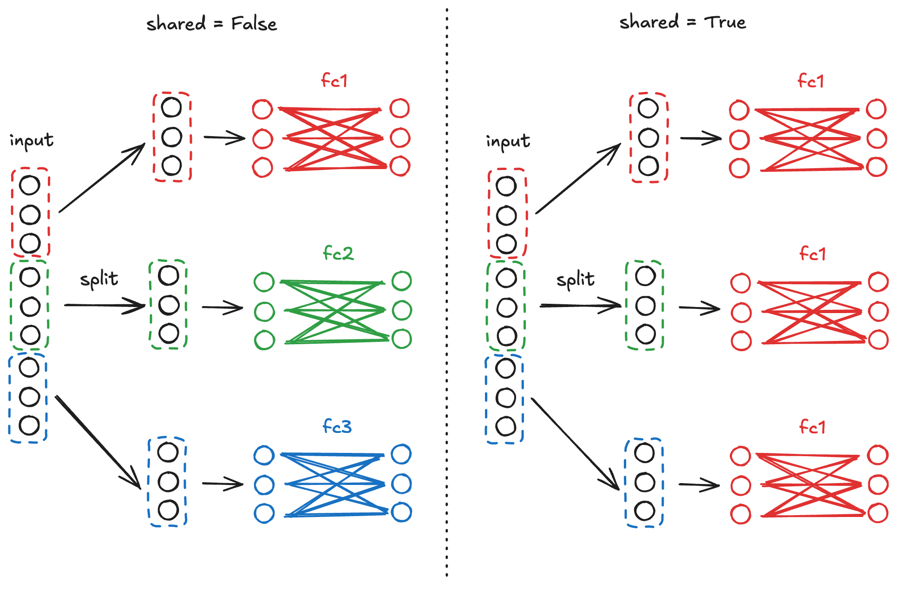

## 0. Docker 환경 준비
```bash
git clone https://github.com/richardSHkim/profiling
cd profiling
docker build -t profiling .
```

## 1. mmdetection은 FLOPs가 아닌 MACs 값을 보고
### linear layer에서의 실증적 검증
```bash
docker run --gpus all --rm profiling linear
```
- 이론적으로, $100 \times 100$ fully-connected layer의 MACs와 FLOPs는 각각 $100 \times 100$ 과 $2 \times 100 \times 100$임.
- mmdetection이 기반하고 있는 mmengine의 `get_model_complexity_info` 함수는 10K라 계산하는 것으로 보아, FLOPs가 아닌 MACs 값을 보고하는 것을 알 수 있음.

### 추가 reference
- mmengine이 참고한 fvcore에서 관련한 [issue report](https://github.com/facebookresearch/fvcore/issues/69)가 있음.
- fvcore와 mmengine의 주석([link1](https://github.com/facebookresearch/fvcore/blob/a491d5b9a06746f387aca2f1f9c7c7f28e20bef9/fvcore/nn/flop_count.py#L57), [link2](https://github.com/open-mmlab/mmengine/blob/390ba2fbb272816adfd2883642326d0fd0ca6049/mmengine/analysis/jit_handles.py#L209-L211))상에서도 이를 간접적으로 파악할 수 있음.

### RTMDET-Ins-s 모델의 올바른 FLOPs 값 계산

```bash
docker run --gpus all --rm profiling rtmdet
```
- input shape $[1, 3, 640, 640]$ 기준으로, mmengine은 21.5 GMACs를 보고함.
- [논문](https://arxiv.org/pdf/2212.07784) Table 3와 [official code의 README](https://github.com/open-mmlab/mmdetection/tree/main/configs/rtmdet#instance-segmentation)에서 RTMDET-Ins-s의 GFLOPs 수치를 21.5로 보고하고 있음.
- 그러나, 비교군으로 사용한 YOLOv5 계열의 Table 3상 수치는 [official repository](https://github.com/ultralytics/yolov5?tab=readme-ov-file#%EF%B8%8F-segmentation)에서 보고하는 FLOPs 값의 절반인 것을 확인할 수 있으며, 이를 통해 RTMDet의 논문에서 수치의 실제 단위가 GMACs라 추정할 수 있음.
- 결과적으로, (fvcore와) mmengine 기반으로 측정했을 때, RTMDet-Ins-s 모델은 43 GFLOPs($= 2 \times 21.5$ GMACs)를 기록함을 도출할 수 있음.

### Warning 관련 첨언
```bash
mmengine - WARNING - Unsupported operator aten::silu_ encountered 92 time(s)
```
- `rtmdet` 옵션으로 코드를 실행하면 위와 비슷한 경고 메시지가 다수 발생하지만, 실제 해당 operation들은 전체 GFLOPs에 영향을 주지 않을 만큼 작은 값을 가짐.


## 2. mmengine 외 여러 FLOPS 계산 툴의 수치 비교

### pytorch profiler
- mmengine을 통해 도출한 값과 같이, pytorch profiler는 RTMDET-Ins-s 모델에 대해서 43 GFLOPs 값을 보고함.
- 그리고 mmengine에서와 달리, unsupported operator에 대한 Warning이 더이상 발생하지 않음.

### calflops와 deepspeed
- calflops와 deepspeed에서 RTMDet-ins-s 모델에 대해 92 GFLOPs를 보고함.
- mmengine과 deepspeed의 profiling 결과를 1:1 로 비교해본 결과, RTMDET의 bbox_head에서 shared layer인 `self.cls_convs`와 `self.reg_convs`의 FLOPs 값이 중복으로 더해지는 오류를 발견함.

### 중복 계산 오류 검증

- 궁극적으로 shared layer를 사용할 때 deepspeed(와 이에 기반한 calflops)에서 FLOPs 계산 오류가 발생한다는 것을 보이고자 함.
- 검증 목적으로, 위 그림과 같이 $100 \times 100$ fully connected layer 3개와 batch norm으로 구성된 네트워크를 준비하였음. (그림상 batch norm은 생략함)
- $[1, 300]$ 크기의 tensor가 $[1, 100]$ 크기의 tensor 3개로 쪼개져서 각각 fully connected layer의 input으로 들어가게 됨.
- 이때, 3개의 fully connected layer가 단일의 shared layer를 사용하면, parameter 수는 줄어드나, FLOPs 값에는 차이가 없어야 함.
- 구체적으로, shared layer의 사용 여부에 상관 없이, 하나의 fully connected layer가 10 KMACs 연산량을 가지기에 총 30 KMACs, 즉 60 KFLOPs를 기록해야 함.

```bash
docker run --gpus all --rm profiling unshared_linears
docker run --gpus all --rm profiling shared_linears
```
- pytorch profiler는 shared layer 사용 여부에 상관 없이 60 KFLOPs를 기록함.
- 반면, calflops와 deepspeed의 경우, shared layer를 사용했을 때, FLOPs가 중복으로 계산되어 60 KFLOPs의 3배인 180 KFLOPs를 보고함.
- 해당 오류는 deepspeed에 [issue](https://github.com/deepspeedai/DeepSpeed/issues/7256)로 남겨놓음.


## 3. Leaderboard Score 수정
- 요약하자면, fvcore와 mmengine의 결과는 사실 MACs 값이었고, calflops, deepspeed는 shared layer에 대해서 중복된 계산값을 보고하고 있었음.
- RTMDET-Ins-s 모델의 FLOPs 값으로 pytorch profiler의 계산 값인 43 GFLOPs를 사용하고자 함.
- Score 계산식에 21 GFLOPs 대신 43 GFLOPs를 대입하면 0.012261 점이 깎이게 되며, 기존 score인 0.50571점에서 해당 값을 빼면, 최종 score는 0.49345점이 됨.
>  $0.1 \times \exp(-21 / 136) - 0.1 \times \exp(-43 / 136) = 0.012261$
